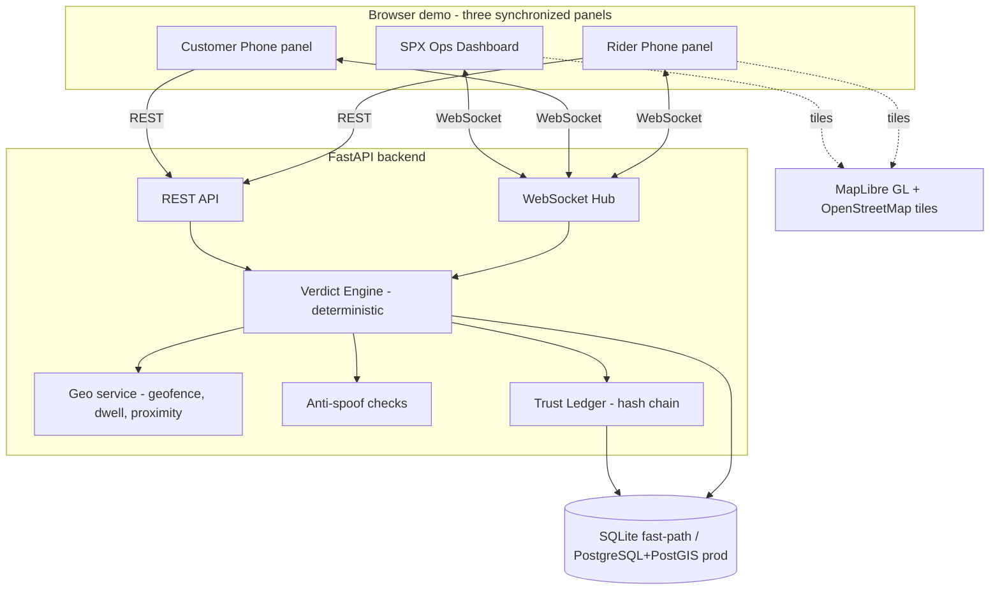
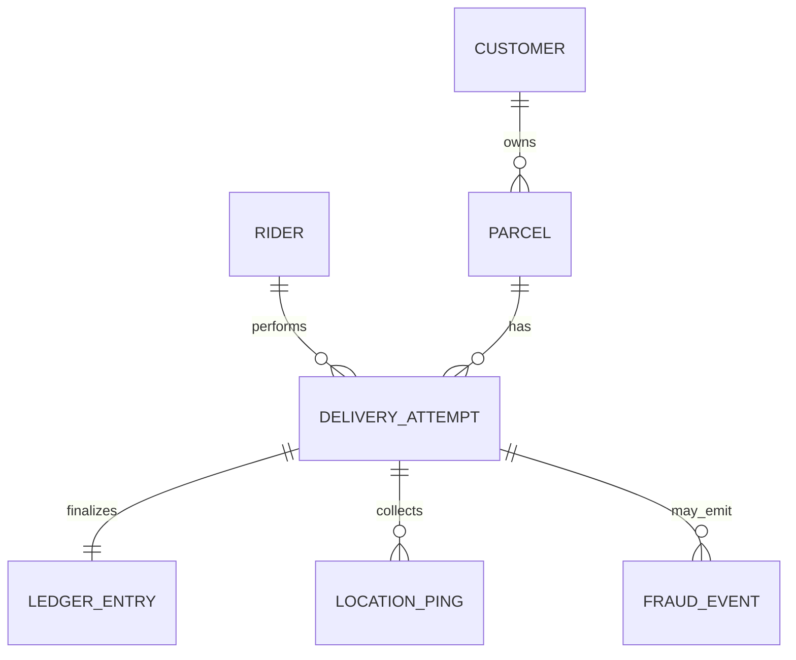
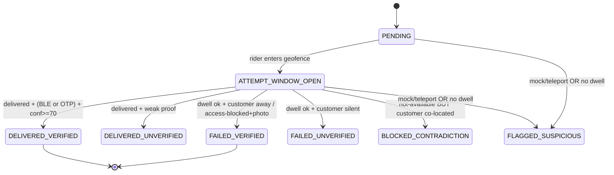
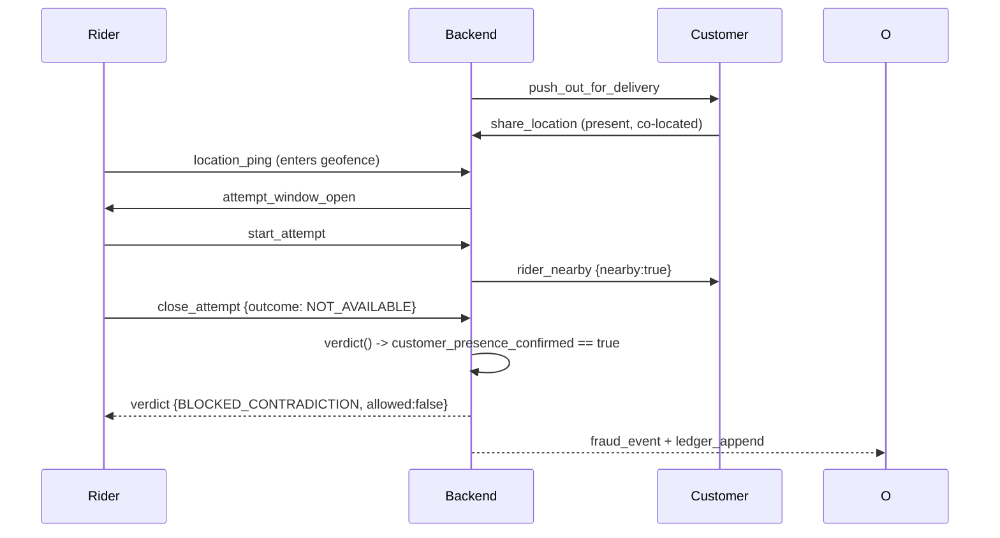
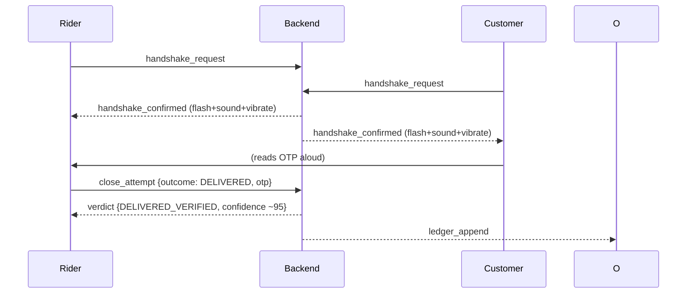

# SPXact — Technical Architecture

**Companion to `01_PRD.md` (why) and `02_MVP_SPEC.md` (what/when). This doc is HOW. All components are free and open source. Two paths are given: a zero-infra Hackathon Fast-Path (default for the one-day build) and a Production path.**

---

## 1. System context



**Key invariant (privacy):** the WebSocket Hub NEVER forwards the customer's raw coordinates to the rider client. The rider client only ever receives a boolean `customer_nearby` and a confidence contribution. Enforce this in the serializer, not just the UI.

---

## 2. Tech stack (all open source)

| Layer | Choice | License | Why / free? |
|---|---|---|---|
| Backend framework | **FastAPI** (Python 3.11+) | MIT | Fast to build in a day, async WebSockets native, auto OpenAPI docs. |
| ORM / models | **SQLModel** (SQLAlchemy + Pydantic) | MIT | One model = DB + schema; minimal boilerplate. |
| DB (fast-path) | **SQLite** | Public domain | Zero setup. Enough for a demo. |
| DB (production) | **PostgreSQL + PostGIS** | PostgreSQL / GPL-compatible | Real geofence/proximity (`ST_DWithin`, `ST_Contains`). |
| Geo math (fast-path) | **shapely** + **geopy** | BSD / MIT | Haversine distance + point-in-circle without PostGIS. |
| Cache / live geo (prod) | **Redis** (`GEOADD`/`GEOSEARCH`) + pub/sub | BSD-3 | Sub-ms proximity at scale. Optional for demo. |
| Realtime | **WebSockets** (FastAPI/Starlette native) | — | Live sync across 3 panels + phones. |
| Push (prod) | **Firebase Cloud Messaging** (free tier) or **ntfy.sh** (Apache-2.0, self-host) | — | Demo uses in-app WS "push". |
| Frontend | **React + Vite + TypeScript** | MIT | Fast dev server, great for projector demo. |
| Styling | **TailwindCSS** | MIT | Speed. |
| Maps | **MapLibre GL JS** + **OpenStreetMap** tiles | BSD / ODbL | Fully open, no API key. |
| Animation | **Framer Motion** | MIT | Confidence dial + handshake flash. |
| Client state | **Zustand** | MIT | Tiny, simple. |
| Anti-spoof (prod device) | Android `isMock()`/`isFromMockProvider()`, **Google Play Integrity**, **Apple App Attest** | — | Native, free. |
| BLE (prod device) | **react-native-ble-plx** or **flutter_reactive_ble** | Apache-2.0 / MIT | Real handshake. Demo simulates over WS. |
| Optional AI (Phase 2) | **scikit-learn** (IsolationForest) | BSD-3 | Spoof anomaly + rider fraud score. Not in MVP. |
| Mobile (prod app) | **Flutter + Tracelet** (Apache-2.0) or **React Native + transistorsoft** (free debug builds) | Apache-2.0 | Background geolocation + geofencing. |
| Container (optional) | **Docker + docker-compose** | Apache-2.0 | One-command prod run. |

---

## 3. Repository structure (backend-focused monorepo)

```
spxact/
├── README.md                      # points to these 4 docs
├── docker-compose.yml             # prod: api + postgres/postgis + redis
├── docs/
│   ├── 01_PRD.md
│   ├── 02_MVP_SPEC.md
│   ├── 03_ARCHITECTURE.md
│   └── 04_DEFINITION_OF_DONE.md
├── backend/                       # <-- primary deliverable folder
│   ├── app/
│   │   ├── main.py                # FastAPI app, CORS, routers, WS mount
│   │   ├── config.py              # env + tunables (DWELL_MIN, GEOFENCE_M, weights)
│   │   ├── db.py                  # engine/session (SQLite fast-path or PG)
│   │   ├── models.py              # SQLModel tables (see §4)
│   │   ├── schemas.py             # request/response DTOs; enforces privacy serializer
│   │   ├── ws_hub.py              # ConnectionManager: rider/customer/ops channels
│   │   ├── services/
│   │   │   ├── geo.py             # geofence entry, dwell timer, proximity (hidden)
│   │   │   ├── spoof.py           # mock flag, teleport/speed, attestation stub
│   │   │   ├── confidence.py      # signal -> score (weights from config)
│   │   │   ├── verdict.py         # THE state machine (PRD §6) - unit tested
│   │   │   └── ledger.py          # hash-chained Trust Ledger
│   │   ├── routers/
│   │   │   ├── parcels.py         # dispatch / out-for-delivery
│   │   │   ├── location.py        # rider + customer pings (REST fallback)
│   │   │   ├── attempts.py        # start / close attempt -> verdict
│   │   │   ├── ble.py             # simulated handshake token exchange
│   │   │   ├── ledger.py          # GET ledger feed
│   │   │   └── fraud.py           # GET heatmap events, POST simulate-week
│   │   └── seed.py                # seed parcels from parcel_history.csv rows
│   └── tests/
│       ├── test_verdict.py        # all 8 states covered
│       ├── test_confidence.py     # weight math + clamping
│       └── test_privacy.py        # rider payload NEVER contains customer coords
└── frontend/
    ├── index.html
    ├── src/
    │   ├── App.tsx                # 3-panel layout + Reset Demo
    │   ├── ws.ts                  # WebSocket client
    │   ├── store.ts               # Zustand state
    │   ├── panels/
    │   │   ├── RiderPhone.tsx
    │   │   ├── CustomerPhone.tsx
    │   │   └── OpsDashboard.tsx
    │   └── components/
    │       ├── ConfidenceDial.tsx # animated 0-100 gauge
    │       ├── HandshakeFlash.tsx # green flash + sound + navigator.vibrate
    │       ├── TrustLedger.tsx    # live-scroll hash feed
    │       ├── FraudHeatmap.tsx   # MapLibre pulsing markers
    │       └── MapPanel.tsx       # shared map w/ geofence circle
    └── package.json
```

---

## 4. Data model



**Tables (SQLModel):**

- **Customer**: `id`, `name`, `phone`, `device_id`, `protection_opt_in: bool`.
- **Rider**: `id`, `name`, `device_id`, `trust_score: float = 100`.
- **Parcel**: `id`, `tracking_no`, `hub_id`, `address_text`, `lat`, `lng`, `geofence_m: int = 90`, `promised_window`, `status: enum(CREATED, OUT_FOR_DELIVERY, DELIVERED, FAILED, RESCHEDULED)`, `customer_id`, `rider_id`.
- **DeliveryAttempt**: `id`, `parcel_id`, `rider_id`, `started_at`, `ended_at`, `dwell_seconds: int`, `verdict_state: enum` (8 states, PRD §6.2), `confidence: int`, `signals_json`, `otp`, `ble_handshake: bool`, `customer_signal_present: bool`, `customer_presence_confirmed: bool`, `mock_location: bool`, `teleport: bool`, `photo_url`, `outcome_requested: enum(DELIVERED, NOT_AVAILABLE, ACCESS_BLOCKED)`.
- **LocationPing** (ephemeral, retention ≤ 24h): `id`, `entity_type: enum(RIDER, CUSTOMER)`, `entity_id`, `lat`, `lng`, `accuracy_m`, `is_mock: bool`, `speed_mps`, `ts`. **Deleted after verdict finalized.**
- **LedgerEntry**: `id`, `attempt_id`, `seq`, `prev_hash`, `hash`, `payload_json`, `ts`.
- **FraudEvent** (heatmap): `id`, `attempt_id`, `lat`, `lng`, `type: enum(BLOCKED_CONTRADICTION, FLAGGED_SUSPICIOUS)`, `ts`.

---

## 5. API contract

### REST
| Method | Path | Body | Returns |
|---|---|---|---|
| POST | `/parcels/{id}/dispatch` | — | Sets `OUT_FOR_DELIVERY`; pushes to customer channel. |
| POST | `/customers/{id}/opt-in` | `{opt_in: bool}` | Consent recorded. |
| POST | `/customers/{id}/share-location` | `{lat,lng,accuracy}` | One-shot; sets `customer_signal_present`. |
| POST | `/location/ping` | `{entity_type,entity_id,lat,lng,accuracy,is_mock,speed}` | Ingest; triggers geofence/teleport checks. (WS preferred.) |
| POST | `/attempts/{parcel_id}/start` | — | Opens `ATTEMPT_WINDOW_OPEN`, starts dwell, pings customer "rider nearby". |
| POST | `/ble/handshake` | `{parcel_id, rider_device, customer_device}` | Exchanges signed token; sets `ble_handshake=true`. |
| POST | `/attempts/{parcel_id}/close` | `{outcome, otp?, photo_url?}` | **Runs Verdict Engine → returns `{state, confidence, signals, allowed}`.** |
| GET | `/attempts/{parcel_id}` | — | Current state + confidence + signals. |
| GET | `/ledger?limit=50` | — | Latest ledger entries (hash-chained). |
| GET | `/fraud/heatmap` | — | Fraud events for map. |
| POST | `/fraud/simulate-week` | — | Replays seeded fraud events for the demo bloom. |
| POST | `/demo/reset` | — | Restores clean seeded state. |

### WebSocket (`/ws/{channel}` where channel ∈ rider, customer, ops)
Server → client messages (JSON `{type, payload}`):
- `push_out_for_delivery` (→customer)
- `rider_nearby` (→customer)  **payload has NO coordinates, just `{nearby: true}`**
- `attempt_window_open` (→ops, →rider)
- `signal_update` (→ops) `{signal, points, confidence}`  — drives the dial
- `handshake_confirmed` (→rider, →customer, →ops) — triggers flash/sound/haptic
- `verdict` (→all) `{state, confidence, allowed, message}`
- `ledger_append` (→ops)
- `fraud_event` (→ops)

Client → server: `location_ping`, `start_attempt`, `close_attempt`, `share_location`, `handshake_request`.

---

## 6. Verdict Engine (authoritative implementation notes)

Implement `services/verdict.py` to match **PRD §6 exactly**. Constants in `config.py`:

```python
DWELL_MIN = 180              # seconds
GEOFENCE_M = 90              # meters
CONF_DELIVERED_MIN = 70

WEIGHTS = {
  "geofence_entered": +15, "dwell_satisfied": +20, "ble_handshake": +35,
  "customer_presence_confirmed": +20, "otp_verified": +25,
  "attestation_pass": +5, "accuracy_good": +5,
  "mock_location": -60, "teleport": -40, "no_geofence_entry": -30, "attestation_fail": -20,
}
```

`compute_confidence(signals) -> clamp(sum(applicable weights), 0, 100)`.
`decide(outcome, signals) -> VerdictState` per the PRD §6.3 decision tree.

**State machine:**


---

## 7. Key sequences

### 7.1 Act 1 — contradiction blocked live


### 7.2 Act 2 — handshake + OTP → delivered


---

## 8. Anti-spoofing layers (MVP builds #1–2, defends #3–5)
1. **Mock-location flag** — `is_mock` on every ping → `-60`, forces `FLAGGED_SUSPICIOUS`. (BUILD: demo toggle.)
2. **Teleport / impossible speed** — server compares consecutive pings; distance/Δt > 55 m/s (~200 km/h) → `teleport=true`, `-40`. (BUILD.)
3. **Device attestation** — Play Integrity / App Attest. (DEFEND.)
4. **Sensor fusion** — flat accelerometer during GPS "motion". (DEFEND.)
5. **BLE handshake** — GPS-independent physical co-location proof. (SIMULATE in MVP, real in prod.)

**Design principle:** never binary allow/block on spoof alone — feed into the confidence score; high-suspicion routes to human review.

---

## 9. Trust Ledger (tamper-evident)
Each finalized verdict appends an entry:
```
payload = {attempt_id, parcel_id, verdict_state, confidence, signals, ts}
prev_hash = last entry hash (or "GENESIS")
hash = sha256(prev_hash + canonical_json(payload))
```
Any edit to a past entry breaks the chain (recompute detects mismatch). This is *hash-chaining* (looks blockchain-grade, no chain/token needed). Expose `GET /ledger` for the live dashboard feed. **Do not oversell as "blockchain"** in Q&A — call it a tamper-evident append-only log.

---

## 10. Privacy & security (DPA 2012)
- **Consent:** opt-in only, purpose-bound ("Delivery Protection"). Stored on `Customer.protection_opt_in`.
- **Data minimization:** rider client payloads pass through a serializer that **strips customer lat/lng**; unit-tested in `test_privacy.py`.
- **Retention:** `LocationPing` rows deleted once the attempt is finalized (≤24h). Only verdict + hashes persist.
- **Transport:** HTTPS/WSS in prod; CORS locked to the frontend origin.

---

## 11. Run instructions

**Hackathon Fast-Path (no Docker, no Postgres):**
```bash
# backend
cd backend && python -m venv .venv && source .venv/bin/activate
pip install fastapi "uvicorn[standard]" sqlmodel shapely geopy
python -m app.seed          # seed demo parcels
uvicorn app.main:app --reload --port 8000
# frontend
cd ../frontend && npm install && npm run dev   # Vite on :5173
```
Open `http://localhost:5173` → three panels. Open Rider/Customer URLs on two phones (same LAN) for the physical handshake.

**Production:**
```bash
docker compose up   # api + postgres/postgis + redis
```

**Config (`.env`):** `DATABASE_URL`, `DWELL_MIN=180`, `GEOFENCE_M=90`, `TELEPORT_MPS=55`, `CORS_ORIGIN`.

---

## 12. Testing
- `test_verdict.py`: table-driven, one case per state (8) + edge combos. **This is the highest-value test — the graded logic.**
- `test_confidence.py`: additive math, clamping to [0,100], negative dominance.
- `test_privacy.py`: assert rider-bound serialized messages contain no `lat`/`lng` for the customer entity.

---

## 13. Phase-2 AI hooks (documented, NOT built for MVP)
- `services/anomaly.py` (future): IsolationForest over ping trajectories + sensor features → spoof score.
- `services/rider_risk.py` (future): supervised model trained on ledger labels (verified vs. suspicious) → per-rider fraud score feeding `Rider.trust_score`.
- Both are additive; the deterministic engine remains the source of truth and the auditable record.
